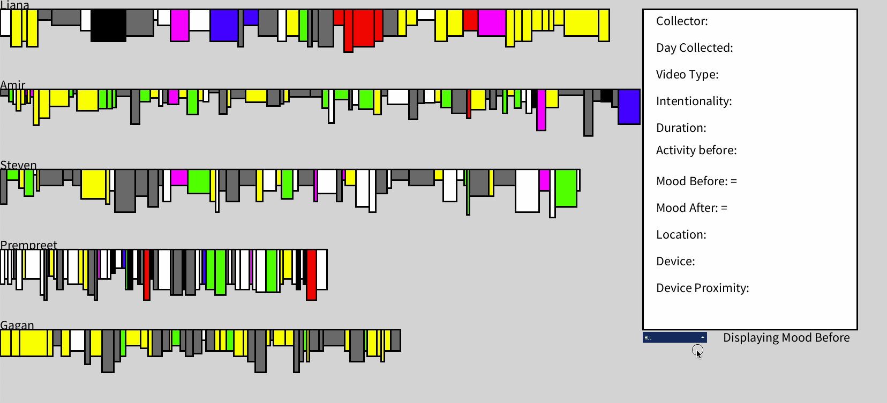
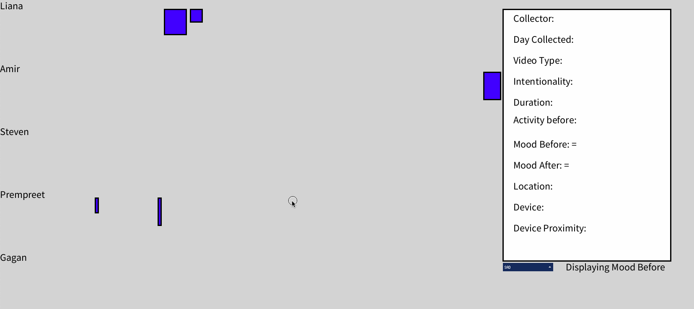

# VideoConsumptionAndMood

An interactive visualization that maps data regarding video consumption habits, helping me determine the influence of the type of video content 
(ie. social media, movie, TV Show, etc) and the duration of the video-watching session (ie. 30 minutes, 60 minutes, etc) on my mood. I then
used the insight gained from this visualization to change my video consumption habits to improve my overall well-being.
Watch quick gif(s) and picture(s) of me interacting with it below:

## Overview:

The research question we chose to answer is: How does the type of video content and duration of session influence a change in mood?  
In our visualization, we represented each data entry as its own rectangle. The width of a rectangle is the duration of the session 
(which is one of our explanatory variables), the height is the intensity of the mood (in other words, its score from 1 to 100), and 
the colour is the mood category (anger is red, sad is blue, happy is yellow, confused is pink, tired is grey, tense is white, afraid is 
black, and energetic is green), with height and colour combining to encode our response variable. 

&nbsp;

When you first run the program, you get to see all 283 data entries; this is the "overview" interaction technique. Overview is useful because 
it gives you a surface-level view of the dataset and lets you decide what data you’d like to get further insight on. For example, here, the 
reader can see that Liana had data points towards the end where she was happy. They can then swap the view to mood after 
to see how video content influenced mood.

## Filtering to See Certain Moods:

Another interaction technique we employed is "Filter". Filter is useful because it allows us to get insights on the moods we choose. 
For example, if a group member wants to know if videos lead to them being less tense (to see if they are a good coping mechanism for the emotion), 
they can go to the dropdown menu and select the Tense mood, and then examine the change in mood before and after. In the gif, you’d see that longer 
session durations tend to reduce one’s tenseness, while shorter video sessions (as seen by the width of the rectangle) seem to have a reduced (or no) effect. 
For example, when me (Prempreet) was tense, only my longer sessions seemed to change my mood.

## Details on Demand:

Our other explanatory variable (type of video content) can be seen by clicking on a rectangle and looking at its detail. This is useful because 
it allows you to see WHAT types of video content influenced mood. For example, when our group was energetic, we saw a large change in our mood's 
after watching a video. When clicking on the rectangles that changed in category, we saw that a good proportion of them were sessions 
consisting of long videos and medium videos. From this, we could infer that long and medium videos lead to other moods overtaking energeticness.

## Toggle (Mood Before vs After):

Note that our research question is examining the CHANGE in mood. This is why we have TWO views; one is the mood BEFORE starting a session, 
and the other is the mood AFTER finishing a session. Note that we have the same set of data, but with a different arrangement. 
This is the "reconfiguration" interaction technique. For example, in the gif, one can see that when our group was angry, the duration of session had 
little influence on our mood. 

&nbsp;

On the other hand, in the gif, one can see that when our group was sad, video content had considerable influence in changing our mood category. 
One can also look at the change in the height of the bars before and after to see how video content influences the intensity of our mood. 
Reconfiguration is probably the most important part of this visualization, because it’s what allows us to see the CHANGE in our mood and answer 
our research question.

## Features
- Each data point holds the day of the week, the video content type (using 8 different classifications of broadcast, live stream, movie, TV/Web Show,
  long video, medium video, short video, and social media clip), intentionality (if the decision to START a session was a conscious one), duration of a session
  (note that a session ends when the user leaves their device, switches apps, or watches a different video content type; so, one session could, for example,
  include 10 different videos). The current activity before viewing (that you were most engaged in). The mood before and after using the VAMS scale
  (where you record your strongest mood and its corresponding score), the physical location (which are the walls of the enclosing building), the viewing device
  (phone, laptop, TV, projector, etc), and the proximity (using Edward T. Hall's four classes of intimate, personal, social, or public).
- You can toggle using spacebar to display the mood before or mood after, allowing you to see the change in mood from a video consumption session.
- You can click on a rectangle to see details about the data point. You can click off the rectangle to stop seeing details about the data point.
- You can filter to only see data points concerning certain moods in the bottom right corner.
- The width of a rectangle is the duration of the session, the height is the intensity of the mood (or its score), the colour is the mood class (anger is red,
  sad is blue, happy is yellow, confused is pink, tired is grey, tense is white, afraid is black, energetic is green).
  
&nbsp;

## Limitations/Design Choices

- An external Processing library was used to show the filter menu

&nbsp;

## If you want to start up the project on your local machine:
1. Download the code as a ZIP:

&nbsp;

2. Open the .pde file:
   

&nbsp;

3. When prompted, keep "SpaceTyping-main" as the sketch folder:
   

&nbsp;
&nbsp;
4. Click the play button on the processing panel to start the sketch:
   

&nbsp;

5. Begin entering mouse and keyboard input to see your constellations!
   

&nbsp;

